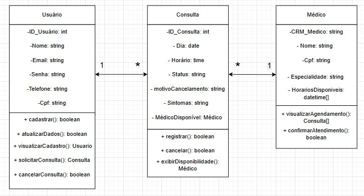
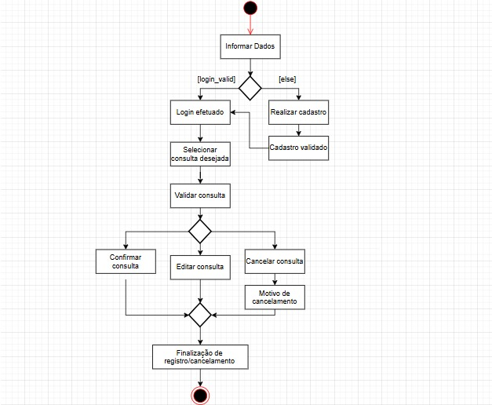

### 1. Diagrama de Classes
    O Diagrama de Classes foi elaborado para representar a estrutura estática do sistema de agendamento de consultas médicas, destacando as principais entidades envolvidas e seus relacionamentos.

    As classes definidas foram:

    Usuário: representa o paciente que acessa o sistema, podendo se cadastrar, atualizar dados e solicitar consultas.

    Médico: representa o profissional de saúde disponível para atendimento, com informações como especialidade e horários disponíveis.

    Consulta: representa o vínculo entre o paciente e o médico, contendo informações sobre data, horário, status, sintomas e motivo de cancelamento.
  
    

    A escolha desse diagrama se justifica por ele permitir visualizar claramente a estrutura de dados e as responsabilidades de cada classe, além de evidenciar as relações 1:N entre usuários, consultas e médicos.
    Isso facilita o entendimento do modelo de domínio e serve de base para o desenvolvimento orientado a objetos do sistema.

### 2. Diagrama de Atividades
    O Diagrama de Atividades foi desenvolvido para representar o fluxo de ações do usuário no processo de login, cadastro e gerenciamento de consultas (confirmação, edição ou cancelamento).

    O diagrama mostra as etapas:

    O usuário informa seus dados.

    O sistema valida o login; se for inválido, ocorre o cadastro.

    Após login, o usuário seleciona e valida uma consulta.

    Dependendo do resultado, ele pode confirmar, editar ou cancelar a consulta, informando o motivo, quando aplicável.

    O processo termina com a finalização do registro ou cancelamento.

    
  
    A escolha desse diagrama se justifica por ele representar o comportamento dinâmico do sistema, descrevendo o fluxo de controle e as decisões lógicas que o usuário e o sistema tomam durante a interação.
    Esse tipo de diagrama é fundamental para compreender a sequência de atividades e as possíveis ramificações do processo.
